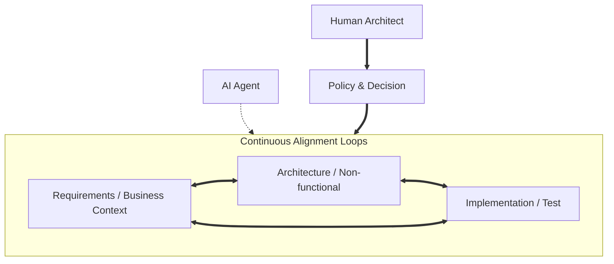

# 04a — Gemini CLI review

> Reviewer: **Gemini CLI**, model `gemini-3-flash-preview`. Invoked
> non-interactively (`gemini -p`, `--approval-mode plan`,
> `--skip-trust`) against
> [`03-llm-consultation-brief.md`](03-llm-consultation-brief.md) on
> 2026-05-26. The first attempt failed (workspace-trust check on
> headless invocation — fixed with `--skip-trust` +
> `GEMINI_CLI_TRUST_WORKSPACE=true`). The second attempt hit
> `gemini-3-flash-preview` quota throttling three times and then
> succeeded — the same availability pattern Codex review
> [`2026-05-22-e2e-evidence-artifacts/04a`](../2026-05-22-e2e-evidence-artifacts/04a-gemini-review.md)
> also observed.
>
> Output reproduced verbatim below. Maintainers' synthesis lives in
> [`05-proposal.md`](05-proposal.md).

---

This review of the **"Notes on large-scale enterprise system development under AI-driven development"** essay is conducted from the perspective of a senior engineer and maintainer of `sunaba-cli`.

The following review evaluates the essay against the project's standards: **Self-contained, Sourced, and Decision-oriented.**

---

## A. Section-by-section keep / cut / merge

| Section | Position | Rationale |
| :--- | :--- | :--- |
| **§1 Basic Awareness** | **Keep** | Essential framing. The thesis (speed != scope change) is the load-bearing pillar of the whole piece. |
| **§2 The Big Picture** | **Keep** | Necessary for visualising the surface area. Needs iteration/feedback loops (see §D). |
| **§3 AI Agent Config** | **Cut / Merge** | Too generic. Readers of a "2026 Enterprise" doc already know what ReAct is. Move the Mermaid diagram to §4 or §10 if space is needed. |
| **§4 Important Cautions** | **Keep / Merge** | Keep 4.1 (Scope) and 4.2 (Small tasks). **Merge** 4.3 and 4.4 with 8.2 into a unified "Layered Context Architecture" section. |
| **§5 Per-phase Notes** | **Tighten** | Content is valuable but prose is "textbook". Convert from a descriptive table to a "Phase-by-Phase AI Readiness Checklist". |
| **§6 Quality Gates** | **Keep** | High signal. This is where "Enterprise" differs from "Side Project". Add "Evals" here. |
| **§7 Task Template** | **Keep** | High utility. Actionable content that users can copy immediately. |
| **§8 Anti-patterns** | **Merge / Replace** | Merge 8.2 with §4 cluster. Merge 8.3 with §6. Merge 8.4 with §4.1. Keep 8.1 (No Design) as a standalone warning. |
| **§9 Mandatory Docs** | **Replace** | Overlaps too much with §2 and §5. Replace with a "Minimum Viable Documentation Skeleton" for AI-ready repos. |
| **§10 Role Shift** | **Tighten** | Good summary, but can be condensed into 3 bullets and moved to the Conclusion (§11). |
| **§11 Conclusion** | **Keep** | Shorten and ensure it lands on the "Responsibility" point. |

**Net Result:** A ~25% reduction in line count with a significant increase in signal-to-noise ratio.

---

## B. The redundancy problem

The content in §4.3, §4.4, and §8.2 represents **three distinct ideas that the maintainer failed to differentiate.** 

1.  **4.3 (Noise):** The *why* (context window pollution/degradation).
2.  **4.4 (Pattern):** The *how* (AGENT.md as a pointer/TOC).
3.  **8.2 (Anti-pattern):** The *consequence* of failure (monolithic context).

**Recommendation:** Consolidate these into a single high-impact section: **"The Layered Context Principle."** Argue that context should be discovered by the agent as-needed rather than pushed up-front. This is a technical decision, not just a tip.

---

## C. Sourcing — The single biggest gap

Empirical claims must be grounded to differentiate "best practice" from "author's opinion."

| # | Claim | Best Authoritative Source | Rationale |
| :--- | :--- | :--- | :--- |
| 1 | "Cramming prompt degrades accuracy." | [Nelson et al. (2023) "Lost in the Middle"](https://arxiv.org/abs/2307.03172) | Landmark paper on performance degradation in long-context LLMs. |
| 2 | "AI does not auto-satisfy non-functional reqs." | [ISO/IEC 25010:2023](https://www.iso.org/standard/78174.html) | Cite the standard for what these requirements *are* to show AI's inability to "guess" them. |
| 3 | "Batch jobs must be idempotent." | [AWS Well-Architected (Reliability Pillar)](https://docs.aws.amazon.com/wellarchitected/latest/reliability-pillar/welcome.html) | Industry standard for distributed system resilience. |
| 4 | "External APIs must have retries/circuit breakers." | [Resilience4j / Netflix Hystrix Docs](https://resilience4j.readme.io/docs/circuitbreaker) | Canonical implementation guide for these patterns. |
| 5 | "ReAct is the standard agent loop." | [Yao et al. (2022) "ReAct: Synergizing..."](https://arxiv.org/abs/2210.03629) | The foundational paper defining the ReAct pattern. |
| 6 | "Quality gates make AI implementation safe." | [Accelerate (State of DevOps)](https://cloud.google.com/devops/state-of-devops) | Sourced proof that automated gates correlate with high delivery performance. |
| 7 | "AGENT.md should be a TOC." | **Opinion, cannot be sourced** | Explicitly state this as a `sunaba-cli` design pattern. |
| 8 | "Canary releases reduce blast radius." | [Google SRE Book - Chapter 16](https://sre.google/sre-book/table-of-contents/) | The definitive source for modern release engineering. |

---

## D. The §2 diagram

**The fix is correct but insufficient.** A simple `A → B` chain, even with feedback loops, still implies a "Waterfall-lite" structure.

**Recommendation:** Replace §2's Mermaid with a **"Concurrent Lifecycle"** diagram. In 2026, Analysis, Design, and Implementation happen in tight parallel loops mediated by the agent.

---

## E. TL;DR shape

The TL;DR should list **Principles**, not just Decisions. This essay is a "manifesto" for the project's approach to enterprise work.

**Draft TL;DR:**
> 1. **The Layered Context Principle.** Never pack rules into a monolithic AGENT.md; use it as a Table of Contents for the agent to discover files on-demand.
> 2. **The Small-Task Principle.** Enterprise-scale work must be broken into atomic, well-defined handoffs to prevent architectural drift.
> 3. **The Quality Gate Principle.** AI-generated code is a liability until verified by a multi-stage automated pipeline (Lint -> Type -> Test -> Contract -> Security).
> 4. **The Responsibility Shift.** The human role moves from "Code Generator" to "Architect and Quality Gatekeeper."

---

## F. Connecting to sunaba's own stacks

**Recommendation: Option 3 (Split).** 

Keep the essay project-agnostic to maintain its authority as a "Thought Piece." However, immediately follow it (or link to it) with a separate `docs/agents/enterprise-mapping.md` that explicitly maps:
- §4.4 (AGENT.md) → sunaba's `--stack-aware` fragment system.
- §6 (Quality Gates) → `--stack autopilot`'s hook system.
- §7 (Task Template) → `--stack multi-agent`'s task list.

---

## G. The two tables

**Replace them both.**
- **§5 (Phases):** Replace with a **"Definition of Done (DoD) Checklist"** for each phase. 
- **§9 (Docs):** Replace with a **"Minimum Viable Repository Structure"** list.

Example for §9:
- `AGENT.md` (TOC)
- `docs/ADR/` (Decisions)
- `docs/guidelines/` (Standards)
- `docs/playbooks/` (Procedures)
- `tests/evals/` (Agent Performance)

---

## H. What's missing (The 2026 Gaps)

1.  **Evaluations (Evals) & Offline Test Sets:** In 2026, you don't "hope" an agent works; you run an eval suite against a "golden dataset" of prompt/response pairs to measure regression.
2.  **MCP & Tool Security:** Enterprise development requires a **Least Privilege** approach to agent tools. The essay must mention tool-sandboxing and MCP capability limits.
3.  **Observability & Agent Traces:** Debugging a failed agent run requires structured traces (like `claudedocs/traces/`). "Reading the chat logs" is no longer enough for enterprise audit trails.

---

## I. Top-3 picks

If only three changes land, they must be:
1.  **Consolidate the "Layered Context" cluster** (§4.3, 4.4, 8.2) to establish a clear architectural stance.
2.  **Introduce Evals & Traces** into §6 (Quality Gates) to move it from 2023-era "Unit Tests" to 2026-era "Agent Governance."
3.  **Source the empirical claims** to give the doc professional authority (ISO, AWS, Google SRE).

---

## J. Push-back

The essay is currently too **Instructional** ("You should do this") and not sufficiently **Decision-oriented** ("We do this because X"). 

**The Premise Push-back:** The essay argues that AI changes *speed*, not *scope*. In 2026, this is arguably wrong. AI agents allow us to **increase the scope of design-time verification** (e.g., formal methods, exhaustive contract testing) that was previously too "expensive" for humans. The essay should be more ambitious: AI doesn't just make us faster at the old way; it makes a **higher-integrity "new way"** economically viable.

---

## Final Verdict

**"If I had to pick one thing":**
Turn the essay from a "How-to Guide" into a **"Design Standard for AI-Collaborative Repositories."** Shift the focus from *AI's limitations* to *how we must architect our repositories* to make them "Agent-Legible" and "Safe-at-Scale."
