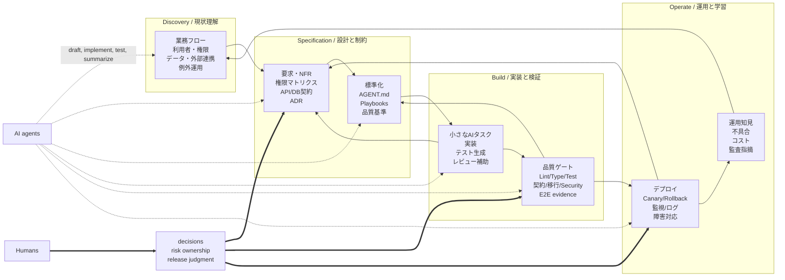

# 04b — Codex CLI review

> Reviewer: **Codex CLI**, model `gpt-5.5`, `model_reasoning_effort=high`.
> Invoked non-interactively (`codex exec`, read-only sandbox, web
> search active — observed querying OpenAI evals docs, Anthropic
> Claude Code memory docs, ISO 25010, AWS Well-Architected, the
> ReAct paper, the "Lost in the Middle" paper, and OWASP LLM Top 10)
> against [`03-llm-consultation-brief.md`](03-llm-consultation-brief.md)
> on 2026-05-26.
>
> Output reproduced verbatim below. Maintainers' synthesis lives in
> [`05-proposal.md`](05-proposal.md).

---

## A. Section-By-Section Keep / Cut / Merge

| Section | Decision | Why |
|---|---:|---|
| §1 Basic recognition | **Tighten** | The thesis is load-bearing: AI accelerates tasks but does not remove enterprise responsibilities. Cut the opening boilerplate and make the thesis sharper. |
| §2 Whole picture | **Replace** | The content matters, but the linear waterfall diagram contradicts the essay’s own argument about feedback, verification, and operations. Replace with a lifecycle loop. |
| §3 Agent structure | **Tighten** | Keep the ReAct/context assembly explanation, but cite ReAct and avoid implying every agent literally follows this architecture. |
| §4 Important cautions | **Merge / restructure** | §4 is the real essay. Keep it, but make it the main body: task boundaries, context design, quality gates, security, NFRs. |
| §4.1 Speed vs success | **Tighten** | Strong section. It should become one of the top principles. Add a source-backed claim that software quality includes explicit quality attributes, not just generated code. |
| §4.2 Small task units | **Keep with examples** | This is practical and specific. It is one of the most useful parts of the essay. Add a “bad / better / best” progression. |
| §4.3 System prompt overload | **Merge with §4.4 and §8.2** | Same idea is repeated. Keep one consolidated “context architecture” section. |
| §4.4 AGENT.md as TOC | **Merge with §4.3** | Valuable, but it should be a concrete design pattern inside the context architecture section, not a separate sermon. |
| §5 Phase table | **Replace with checklist matrix** | The table is useful but passive. Enterprise readers need “what artifact/gate must exist before AI work proceeds.” |
| §6 Quality gates | **Keep and expand** | This is the strongest operational section. Add evals, CI evidence, security checks, and deployment gates. |
| §7 Task template | **Keep** | It is practical, reusable, and distinguishes the essay from generic commentary. Add fields for risk, data sensitivity, rollback, and evidence artifacts. |
| §8 Antipatterns | **Merge** | Keep the patterns, but fold each antipattern into the positive principle it violates. A separate antipatterns chapter repeats earlier material. |
| §9 Mandatory documents | **Replace** | The list is useful but too flat. Replace with a `docs/` skeleton or checklist with owner/status/link columns. |
| §10 Human role | **Tighten** | Keep the thesis, but avoid the simplistic “builder to evaluator” framing. In enterprise work, humans still build; the shift is toward specification, verification, risk ownership, and release judgment. |
| §11 Summary | **Replace** | The conclusion should become a decision-oriented proposal: principles adopted, rejected approaches, minimum artifacts, and next actions. |

If more than three sections are cut or merged, the document loses some “teaching repetition,” but that is acceptable. The current essay is too padded for a thinking doc.

## B. Redundancy Problem

§4.3, §4.4, and §8.2 are **one idea stated three times**.

The single idea is: agent instructions should be layered, scoped, and retrievable instead of poured into one always-loaded file. The revised essay should consolidate this into one section:

1. **System prompt:** invariant behavior and safety boundaries.
2. **AGENT.md / CLAUDE.md / GEMINI.md:** repository map, required reads, commands, forbidden zones.
3. **Playbooks:** task-specific procedures.
4. **Specs/tests/source:** truth sources.
5. **Retrieved context:** only what the current task needs.

This is supported by current agent documentation: Anthropic’s Claude Code memory docs recommend concise, well-structured project instructions and separate imported files for detail ([Anthropic Claude Code memory](https://docs.anthropic.com/en/docs/claude-code/memory)); OpenAI’s Codex documents how AGENTS.md is assembled into the agent’s instruction context ([OpenAI Codex AGENTS.md docs](https://github.com/openai/codex/blob/main/docs/agents_md.md)).

## C. Sourcing: Best Sources For Load-Bearing Claims

| Claim | Best source | Judgment |
|---|---|---|
| 1. Cramming the system prompt with rules degrades accuracy. | [Lost in the Middle, TACL 2024](https://arxiv.org/abs/2307.03172) plus [Anthropic Claude Code memory](https://docs.anthropic.com/en/docs/claude-code/memory). | Sourceable only if softened: long context can reduce effective retrieval/use of relevant information; agent docs recommend concise structured memory. Do not state as universal “accuracy degrades.” |
| 2. AI does not auto-satisfy NFRs unless explicit. | [ISO/IEC 25010:2023](https://www.iso.org/standard/78176.html). | Source as software quality requirements needing specification/evaluation. The “AI” part is inference, not directly sourced. |
| 3. Batch jobs must be idempotent. | [AWS Well-Architected Reliability Pillar](https://docs.aws.amazon.com/wellarchitected/latest/reliability-pillar/welcome.html). | Strong source. AWS explicitly treats idempotency as a reliability best practice for mutating operations. |
| 4. External API integrations need retries, timeouts, circuit breakers. | [Azure transient fault handling](https://learn.microsoft.com/en-us/azure/architecture/best-practices/transient-faults). | Strong source. It covers finite retries, timeout budgets, idempotency, and circuit breakers. |
| 5. ReAct is the standard agent loop. | [ReAct paper](https://arxiv.org/abs/2210.03629). | Source the pattern, not “standard.” Say “a common agent-loop pattern.” |
| 6. Quality gates make AI implementation safe at scale. | [OpenAI evaluation best practices](https://platform.openai.com/docs/guides/evaluation-best-practices) and [OpenAI Evals cookbook](https://cookbook.openai.com/examples/evaluation/getting_started_with_openai_evals). | Source as evals/continuous evaluation improving reliability. “Safe at scale” is an engineering position. |
| 7. AGENT.md should be a TOC, not a giant rulebook. | [Anthropic Claude Code memory](https://docs.anthropic.com/en/docs/claude-code/memory). | Partly sourceable. Docs support concise project memory and imports. “TOC not rulebook” is the essay’s opinion. |
| 8. Canary releases reduce blast radius. | [AWS Well-Architected canary deployment](https://wa.aws.amazon.com/wellarchitected/2020-07-02T19-33-23/wat.concept.canary-deployment.en.html). | Strong source. AWS frames canary deployment as risk reduction for new versions. |

## D. The §2 Diagram

Pick **2: the fix is not enough; replace the diagram wholesale**.

Adding `G → F` and `H → D` patches the waterfall, but the real model should show four loops: discovery, specification, implementation, and operation. AI touches all loops; humans own decisions and gates.



## E. TL;DR Shape

Use **five principle bullets**, not “decisions.” This is an essay, not an implementation proposal. Then end the document with explicit decisions and rejected alternatives.

Draft:

```markdown
> **TL;DR**
>
> - AI-driven development does not remove enterprise development work; it moves the bottleneck to specification, context design, verification, and operations.
> - Treat coding agents as fast executors inside bounded tasks, not as owners of business rules, data responsibility, authorization, audit, or release judgment.
> - Keep agent context layered: minimal system prompt, repository-level index, task playbooks, source/specs/tests as truth, and retrieved detail only when needed.
> - Make non-functional requirements explicit: security, availability, performance, observability, privacy, rollback, migration, and cost do not appear reliably by implication.
> - Scale AI implementation through automated gates: tests, contract checks, migration checks, security scans, evals, traces, staged rollout, and human approval.
```

## F. Connecting To sunaba’s Own Stacks

Pick **3: split it**.

Keep the essay project-agnostic, and add a separate `docs/agents/enterprise.md` or companion thinking proposal that maps principles to sunaba stacks. The essay should outlive sunaba’s current flag names. The mapping document should be concrete:

| Essay principle | sunaba stack |
|---|---|
| Context layering | `--stack rules`, per-stack `AGENTS.md` / `CLAUDE.md` / `GEMINI.md` |
| Planning / verifier roles | `--stack harness` |
| Evidence artifacts | forthcoming `evidence/e2e/` convention |
| Guardrails and budgets | `--stack autopilot` |
| Secrets and cloud access | `--stack secrets` |
| Parallel bounded work | `--stack multi-agent` |

Putting all of that into the essay would make the piece look like product documentation. Keeping it separate lets the essay stay principled and the sunaba doc stay actionable.

## G. The Two Tables

§5 should become a **phase checklist matrix**, not a descriptive table. Add columns: `phase`, `AI can help`, `required human decision`, `required artifact`, `quality gate`. Keep most rows, but merge “architecture” and “non-functional requirements” because they should be decided together.

§9 should become a **docs skeleton with status fields**, not a prose table:

```markdown
docs/
  architecture/overview.md
  adr/
  domain/glossary.md
  domain/business-flows.md
  security/authz-matrix.md
  api/openapi.yaml
  database/schema.md
  operations/runbook.md
  operations/rollback.md
  testing/strategy.md
  agents/AGENT.md
  agents/playbooks/
```

Add rows for `data-classification.md`, `agent-security.md`, `evals.md`, and `observability.md`. Cut no core rows; enterprise systems really do need most of them.

## H. What’s Missing

**1. Evals and offline test sets.**  
Add: “AI-driven development needs evaluation datasets, not just CI. Keep representative prompts, expected outputs, regression bugs, security cases, and domain edge cases as versioned evals. Run them when changing prompts, models, tools, or playbooks. OpenAI’s evaluation guidance recommends continuous evaluation so behavior remains stable across code and model changes ([OpenAI evaluation best practices](https://platform.openai.com/docs/guides/evaluation-best-practices)).”

**2. Agent security and prompt injection.**  
Add: “Coding agents read untrusted text from issues, docs, logs, webpages, dependency output, and source comments. Treat those inputs as hostile. Tool permissions, network access, secret access, and write access must be scoped. OWASP’s LLM Top 10 identifies prompt injection, sensitive information disclosure, supply-chain risk, and excessive agency as first-class risks for LLM applications ([OWASP LLM Top 10 2025](https://owasp.org/www-project-top-10-for-large-language-model-applications/)).”

**3. Observability for agent work.**  
Add: “For enterprise use, the agent’s work must be auditable: prompt, selected context, tool calls, file diffs, test results, approvals, and deployment evidence should be retained according to policy. Agent traces are not just debugging convenience; they are review and incident artifacts. OpenAI’s Agents SDK tracing records model generations, tool calls, handoffs, guardrails, and custom events ([OpenAI Agents SDK tracing](https://github.com/openai/openai-agents-python/blob/main/docs/tracing.md)).”

## I. Top-3 Picks

1. **Replace the waterfall diagram and rewrite the essay around lifecycle loops.** The current diagram teaches the wrong operating model.
2. **Consolidate the AGENT.md/context material into one sourced “context architecture” section.** This removes the biggest redundancy.
3. **Add evals, agent security, and evidence/trace gates to the quality-gate section.** Without those, the essay is 2024-era coding-agent advice, not 2026 enterprise guidance.

## J. Push-Back

This essay should not be cut, but it should stop pretending to be just a neutral checklist. Its actual position is strong: enterprise AI development succeeds only when humans design the operating system around the agents.

The premise “AI changes speed but not the overall work” is too conservative. AI changes the coordination model: smaller task packets, more verification artifacts, more automated gates, more traceability, and a higher premium on written context. Say that directly.

Japanese-only is fine. The repo can carry a Japanese essay if the sources are international and the conclusions are explicit. The bigger problem is not language; it is lack of citations and lack of decisions.

**If I had to pick one thing:** rewrite the essay from “AI makes implementation faster, so remember enterprise basics” to “enterprise AI development is context architecture plus verification architecture.” That is the durable thesis.
