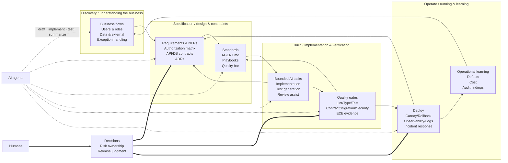

# 05 — Proposal: the enterprise-development essay, revised

> Status: **draft / in review**. Synthesises
> [`04a-gemini-review.md`](04a-gemini-review.md) (Gemini
> `gemini-3-flash-preview`) and [`04b-codex-review.md`](04b-codex-review.md)
> (Codex CLI `gpt-5.5`, high reasoning) against the
> [consultation brief](03-llm-consultation-brief.md).
>
> This proposal does **not** rewrite the essay inline; that is a
> follow-up PR. This document records the eight decisions, the
> alternatives considered, and what the rewrite must contain.

## TL;DR — the eight decisions

1. **Reframe the thesis.** The essay's current premise ("AI
   changes speed, not scope") is too modest. The revised thesis,
   shared by both reviewers, is: *AI changes the coordination
   model — smaller task packets, more verification artefacts,
   more written context, more automated gates, more traceability
   — and that shift is what makes high-integrity enterprise work
   economically viable.* See §1 below.

2. **Replace §2's linear flowchart with a four-loop lifecycle**
   (Discovery → Specification → Build → Operate, with feedback
   edges). Both reviewers independently rejected the user's
   "just add `G→F` and `H→D`" patch and called for wholesale
   replacement. See §3 below.

3. **Consolidate §4.3 + §4.4 + §8.2 into one section: "The
   Layered Context Principle."** Both reviewers identified this
   as the largest redundancy. The merged section gets a five-tier
   structure (system prompt → AGENT.md → playbooks → specs/tests
   → retrieved detail) and replaces 3 sermons with 1 design
   pattern. See §4 below.

4. **Add eight inline citations** for the load-bearing empirical
   claims. The two reviews converge on the same eight sources
   (with minor divergence on circuit-breakers and canary). See §5
   below.

5. **Replace both descriptive tables (§5, §9) with actionable
   artefacts.** §5 becomes a phase-by-phase checklist matrix with
   the five columns Codex named (phase / AI can help / required
   human decision / required artifact / quality gate). §9 becomes
   a `docs/` skeleton listing — not a prose table — with rows
   added for `data-classification.md`, `agent-security.md`,
   `evals.md`, and `observability.md`. See §6 below.

6. **Add three missing topics to §6 (Quality Gates):** evals,
   agent security / prompt injection, and observability / agent
   traces. Both reviewers independently named these same three
   omissions. See §7 below.

7. **Keep the essay project-agnostic; ship a companion sunaba
   mapping as `docs/agents/enterprise.md`.** Both reviewers
   picked option F-3 (split). The essay should outlive sunaba's
   current flag names; the mapping doc stays in sunaba and
   evolves with the stacks. See §8 below.

8. **Translate to English; preserve the Japanese original.** The
   revised essay lives at
   `thinking/2026-05-26-enterprise-development/README.md`
   (replacing the current Japanese-only essay), with a
   `README.ja.md` next to it carrying the updated Japanese
   version. This matches the repo's existing main-README
   bilingual convention.

> **What we are not deciding here.** The actual prose rewrite is a
> follow-up PR. This document is the spec for that PR.

---

## 1. The reframed thesis

**Original framing** (essay §1, §11):

> AI accelerates parts of the work — implementation, generation,
> review — but the overall enterprise development work stays the
> same. Humans must own the whole.

**Pushback from both reviewers.** Codex called the framing "too
conservative" and noted that AI also changes the *coordination*
model. Gemini went further: AI makes design-time verification
(formal methods, exhaustive contract testing, multi-model evals)
economically viable for projects where it previously wasn't.

**Adopted framing for the revised essay:**

> Enterprise AI-driven development is **context architecture plus
> verification architecture**. AI does not remove the enterprise
> work; it moves the bottleneck — and the new bottleneck rewards
> teams that have written down their context layering, their
> verification gates, and their evidence trail. The work hasn't
> shrunk; it has shifted from typing to specifying, and from
> reviewing diffs to designing gates.

This belongs in the opening (replacing the current §1) and is the
through-line for every later section.

---

## 2. Section-by-section disposition

Where the two reviewers diverged, the proposal column records the
adopted resolution and the reason.

| # | Section | Codex | Gemini | Proposal | Reason |
|---|---|---|---|---|---|
| §1 | Basic recognition | tighten | keep | **Tighten + reframe** | Adopt the new thesis (§1 above). Cut the opening boilerplate. |
| §2 | Big picture | replace | keep w/ loops | **Replace** | Both saw waterfall as wrong; Codex's wholesale replacement is the safer fix. See §3 below. |
| §3 | Agent structure (ReAct) | tighten | cut/merge | **Tighten** | Codex wins: 2026 enterprise readers do *not* uniformly know ReAct. Cite the paper, drop the "every agent is ReAct" implication, keep the diagram. |
| §4.1 | Speed vs success | tighten | keep | **Tighten and promote** | Becomes one of the four/five TL;DR principles. |
| §4.2 | Small task units | keep w/ examples | keep | **Keep and expand** | Add the "bad / better / best" progression Codex proposed. |
| §4.3 | System prompt overload | merge | merge | **Merge into §4.x** | See §4 below ("Layered Context Principle"). |
| §4.4 | AGENT.md as TOC | merge | merge | **Merge into §4.x** | See §4 below. |
| §5 | Phase table | replace w/ matrix | tighten to checklist | **Replace** | Codex's checklist-matrix shape (5 columns) is more useful than a DoD checklist. See §6 below. |
| §6 | Quality gates | keep + expand | keep + add evals | **Keep, expand by three topics** | Both want evals; we also add agent security and observability. See §7 below. |
| §7 | Task template | keep w/ fields | keep | **Keep and expand** | Add Codex's four new fields: risk, data sensitivity, rollback, evidence artefact pointer. |
| §8.1 | No design | merge | standalone | **Keep as standalone** | Gemini's read: this is the only antipattern that doesn't duplicate a positive principle. |
| §8.2 | AGENT.md monolith | merge | merge | **Merge** | Folded into §4.x. |
| §8.3 | Skip tests | merge w/ §6 | merge w/ §6 | **Merge with §6** | Both reviewers agree. |
| §8.4 | NFR last | merge w/ §4.1 | merge w/ §4.1 | **Merge with §4.1** | Both reviewers agree. |
| §9 | Mandatory docs | replace w/ skeleton | replace w/ skeleton | **Replace** | See §6 below. Add 4 new rows. |
| §10 | Human role | tighten, drop "builder→evaluator" | tighten, condense | **Tighten with Codex's nuance** | Humans still build; the shift is to specification, verification, risk ownership, and release judgment — not from "maker" to "non-maker." |
| §11 | Summary | replace w/ decisions | keep & shorten | **Replace** | The thinking/ bar requires a decision-oriented ending. Add an "alternatives considered and rejected" register. |

**Net change**: target ~25 % line reduction (Gemini's estimate);
structure goes from 11 flat sections to roughly 8: thesis,
lifecycle diagram, context architecture, task boundaries, quality
gates, task template, docs skeleton, role shift + decisions.

---

## 3. The new §2 diagram

The brief asked the reviewers to choose between three options
(fix the arrows / replace wholesale / cut entirely). Both picked
"replace wholesale," and both produced Mermaid sources. The
proposal adopts **Codex's four-loop diagram** as the base, with
two small additions from Gemini's version: the explicit
human-decision node and the bidirectional `<==>` style for
intra-loop edges (so the visual difference between "AI assists"
and "humans decide" is unmistakable).

Why Codex's over Gemini's: Codex's diagram preserves the original
essay's content (the eight boxes from `A` through `H` survive as
labels inside the four subgraphs), so the revised diagram reads
as a *fix* of the old one, not a clean-slate replacement. Gemini's
3-node diagram is too abstract for the essay's enterprise
audience.

**Adopted Mermaid source** (will live in revised essay §2):



Caption (drafted): *AI agents touch every loop; humans own the
decisions feeding back into specification, gating, and
operation.*

---

## 4. The "Layered Context Principle" merge

Replaces §4.3 + §4.4 + §8.2. The merged section is one
prose-and-table block of roughly the same length as any one of
the three originals — net saving ≈ 60 lines.

**Structure:**

- **One-paragraph principle:** agent instructions should be
  layered, scoped, and retrievable, not poured into one
  always-loaded file.
- **The five tiers** (Codex's list, lightly edited):
  1. **System prompt** — invariant behaviour and safety
     boundaries. Smallest. Set by the agent runtime / harness.
  2. **AGENT.md / CLAUDE.md / GEMINI.md** — repository map,
     required reads, commands, forbidden zones. The *index*, not
     the *content*.
  3. **Playbooks** — task-specific procedures (`docs/playbooks/`).
     Loaded only when the matching task starts.
  4. **Specs, tests, source** — the truth sources. The agent
     reads these on demand.
  5. **Retrieved context** — only what the current task needs.
     Tool-driven, not pre-loaded.
- **The AGENT.md skeleton** (the current §4.4 fenced block) — kept
  verbatim. Best concrete artefact in the essay.
- **The information-placement table** (the current §4.3 table) —
  kept, but with a row added for "evaluation datasets / golden
  tests" pointing to `tests/evals/`.
- **The §8.2 anti-pattern Mermaid** — cut. It is a visual
  restatement of the principle the section above already names.

**Sources to cite inline:**

- Long-context degradation: Liu et al., *Lost in the Middle:
  How Language Models Use Long Contexts*, TACL 2024
  (<https://arxiv.org/abs/2307.03172>). Stated as "long context
  can reduce effective retrieval," not "accuracy degrades."
  (Both reviewers warned against the absolute framing.)
- Layered project memory: Anthropic Claude Code memory docs
  (<https://docs.anthropic.com/en/docs/claude-code/memory>).
- AGENTS.md as instruction context: OpenAI Codex AGENTS.md docs
  (<https://github.com/openai/codex/blob/main/docs/agents_md.md>).

---

## 5. Source matrix for load-bearing claims

Adopted from the two reviewers' tables. Where they diverged, the
proposal column records the resolution.

| # | Claim | Codex's source | Gemini's source | Adopted source | Note |
|---|---|---|---|---|---|
| 1 | Long context degrades retrieval | Liu et al., *Lost in the Middle*, TACL 2024 + Anthropic Claude Code memory | Same paper | **Both, plus Anthropic** | Soften the claim: "can reduce" not "degrades." |
| 2 | NFRs are not implicit | ISO/IEC 25010:2023 | ISO/IEC 25010:2023 | **ISO/IEC 25010:2023** | Same source; cite the 2023 update. |
| 3 | Batch idempotency | AWS Well-Architected Reliability Pillar | Same | **AWS Well-Architected Reliability Pillar** | Strong consensus. |
| 4 | Retries / timeouts / circuit breakers | Azure transient-fault handling | Resilience4j docs | **Both** | Azure for the *pattern*, Resilience4j for the *implementation reference*. |
| 5 | ReAct is *a* common loop (not *the* standard) | Yao et al. (2022) | Same | **Yao et al. (2022)** | Both reviewers asked us to drop the word "standard." |
| 6 | Quality gates / evals improve reliability | OpenAI evaluation best practices + cookbook | *Accelerate* / State of DevOps | **Both** | OpenAI for AI-specific evals; *Accelerate* for the general DORA result that gates correlate with delivery performance. |
| 7 | AGENT.md as TOC | Anthropic Claude Code memory (partial) | Marked as opinion | **Mark as opinion** | Inspired by Anthropic's "concise project memory" guidance; the TOC framing is the maintainer's. |
| 8 | Canary reduces blast radius | AWS Well-Architected canary | Google SRE book ch. 16 | **Google SRE book** | SRE book is the more durable / vendor-neutral citation. |

Add one source not in the brief but flagged by both reviewers in
their "what's missing" answers:

| 9 | Agent security risks (prompt injection, excessive agency, sensitive disclosure) | OWASP LLM Top 10 (2025) | OWASP LLM Top 10 | **OWASP LLM Top 10 (2025)** |

---

## 6. The replacement tables

### §5 — phase checklist matrix

Five columns (Codex's spec, slightly renamed for English):

| Phase | AI can help with | Human decision required | Required artefact | Quality gate before next phase |
|---|---|---|---|---|

Row count: 7 (merge architecture + NFR per Codex), down from 8.
Each row's "required artefact" cell links to a `docs/` skeleton
file (see §6.2). Each row's "quality gate" cell links to one or
more gates from §7.

### §9 — docs skeleton (replaces the prose table)

```text
docs/
  architecture/
    overview.md
  adr/
    NNNN-<slug>.md          # one per architecturally significant decision
  domain/
    glossary.md             # business term canonicalisation
    business-flows.md
  security/
    authz-matrix.md
    agent-security.md       # NEW — prompt-injection threat model, tool scoping
  data/
    classification.md       # NEW — PII / PCI / regulatory class per field
  api/
    openapi.yaml            # source-of-truth for API contracts
  database/
    schema.md
    migrations/             # rollback-able by construction
  operations/
    runbook.md
    rollback.md
    observability.md        # NEW — traces, dashboards, SLOs
  testing/
    strategy.md
    evals.md                # NEW — agent-eval golden set
  agents/
    AGENT.md                # TOC, not content
    playbooks/              # one per recurring task type
```

The four `NEW` rows (`agent-security.md`,
`data/classification.md`, `observability.md`, `evals.md`) close
the 2026 gaps both reviewers named in §H of their reviews.

---

## 7. §6 expansion — three new gates

Both reviewers independently named the same three omissions
("what's missing" in their §H). Each becomes a one-paragraph
sub-section of the revised §6.

### 7.1 Evals and offline test sets

Adopted verbatim from Codex's §H.1:

> AI-driven development needs evaluation datasets, not just CI.
> Keep representative prompts, expected outputs, regression bugs,
> security cases, and domain edge cases as versioned evals. Run
> them when changing prompts, models, tools, or playbooks.
> ([OpenAI evaluation best practices](https://platform.openai.com/docs/guides/evaluation-best-practices))

Quality-gate impact: add an **Eval gate** row to the gate list in
§6, and an `eval-set-fresh` boolean to the deployment checklist.

### 7.2 Agent security and prompt injection

Adopted verbatim from Codex's §H.2:

> Coding agents read untrusted text from issues, docs, logs,
> webpages, dependency output, and source comments. Treat those
> inputs as hostile. Tool permissions, network access, secret
> access, and write access must be scoped.
> ([OWASP LLM Top 10 2025](https://owasp.org/www-project-top-10-for-large-language-model-applications/))

Quality-gate impact: add a **Tool-scope review** gate (least
privilege check for MCP servers, secret access, write paths) and
link to `security/agent-security.md` in the skeleton.

### 7.3 Observability for agent work

Adopted verbatim from Codex's §H.3, with Gemini's wording added
to the trace-types list:

> For enterprise use, the agent's work must be auditable: prompt,
> selected context, tool calls, file diffs, test results,
> approvals, and deployment evidence should be retained according
> to policy. Agent traces are review and incident artefacts —
> like `claudedocs/traces/` or
> [`evidence/e2e/`](../2026-05-22-e2e-evidence-artifacts/05-proposal.md),
> they are committed alongside the code change.
> ([OpenAI Agents SDK tracing](https://github.com/openai/openai-agents-python/blob/main/docs/tracing.md))

Quality-gate impact: tie this to the `--stack harness`
`claudedocs/traces/` convention and the forthcoming
`evidence/e2e/` artefact in the sunaba-mapping companion (§8).

---

## 8. The sunaba mapping (companion doc, not in the essay)

Both reviewers chose option F-3: the essay stays
project-agnostic; a separate companion document does the mapping.

**Where it lives:**
`thinking/2026-05-26-enterprise-development-improvements/06-sunaba-mapping.md`
(or, if it grows past one page,
`docs/agents/enterprise.md` in the main project).

**What it contains:** the Codex-supplied mapping table verbatim,
plus per-row links to the relevant `--stack` proposal in
`thinking/`.

| Essay principle | sunaba mechanism |
|---|---|
| Layered context (§4.x) | Per-stack `AGENTS.md`/`CLAUDE.md`/`GEMINI.md` fragments — see [`2026-05-09-stack-aware-agent-files/`](../2026-05-09-stack-aware-agent-files/) |
| Path-scoped rules | `--stack rules` — see [`2026-05-09-rules-and-autonomy/`](../2026-05-09-rules-and-autonomy/) |
| Bounded task units (§4.2) | `--stack multi-agent` task list — see [`2026-05-09-multi-agent-orchestration/`](../2026-05-09-multi-agent-orchestration/) |
| Verifier / planner roles (§6) | `--stack harness` — see [`2026-05-09-harness-engineering/`](../2026-05-09-harness-engineering/) |
| Stop-hook budgets & branch protection (§6) | `--stack autopilot` |
| Secrets & cloud access (§7.2) | `--stack secrets` |
| Evidence artefacts (§7.3) | `evidence/e2e/` — see [`2026-05-22-e2e-evidence-artifacts/`](../2026-05-22-e2e-evidence-artifacts/) |

This is intentionally **a separate doc**, not a final section of
the essay. The essay's principles outlive sunaba's current flag
names. The companion document is allowed to age and be rewritten
as sunaba's stacks evolve.

---

## 9. Alternatives considered and rejected

- **Rewrite the essay in place, English-only, no Japanese.**
  Rejected. The original is a stable artefact and a Japanese-only
  reader of the repo should still be able to read the
  pre-revision version. Solution: keep
  `thinking/2026-05-26-enterprise-development/README.md` as the
  English revised essay, ship a `README.ja.md` next to it, and
  retain this proposal folder as the change history.
- **Cut §3 (Agent structure) entirely** (Gemini's stronger
  position). Rejected — Codex's "tighten and cite" wins. Enterprise
  readers are not uniformly familiar with ReAct in 2026; the
  diagram earns its space if we cite the original paper.
- **Replace the §2 diagram with Gemini's 3-node loop.** Rejected
  in favour of Codex's 4-loop diagram, on grounds that it
  preserves the original essay's eight content boxes and reads as
  a fix rather than a wholesale break.
- **Use AWS Well-Architected canary as the canary source**
  (Codex's pick). Rejected in favour of the *Google SRE Book*
  (Gemini's pick), as the more vendor-neutral and longer-lived
  citation.
- **Add a "use sunaba" section to the essay itself.** Rejected —
  both reviewers picked option F-3. The mapping lives in a
  companion doc.
- **Add formal-verification / property-based testing as a fourth
  missing topic** (a candidate from Gemini's J pushback). Held
  off. Reasonable in principle, but neither reviewer named it
  inside their "top three omissions" answer. Add it later if a
  third reviewer flags it.
- **Add a per-section author / owner table** (a thinking/-style
  habit). Held off. The essay is a single-author opinion piece;
  the proposal document already records provenance.

---

## 10. Next actions

In order:

1. **PR 1 — this folder.** Land
   `thinking/2026-05-26-enterprise-development-improvements/`
   (this folder, plus `README.md` index) as a single PR. No
   change to the original essay yet. The PR is the review
   record.

2. **PR 2 — the essay rewrite.** Apply the eight decisions to
   `thinking/2026-05-26-enterprise-development/README.md`.
   Translate to English. Add `README.ja.md`. Bump the index
   entry in `thinking/README.md` to describe the new shape.

3. **PR 3 — the sunaba mapping companion.** Either
   `06-sunaba-mapping.md` in this folder, or
   `docs/agents/enterprise.md` in the project root,
   per maintainer choice.

4. **PR 4 — the four `NEW` doc-skeleton rows.** Ship empty
   `data/classification.md`, `security/agent-security.md`,
   `operations/observability.md`, and `testing/evals.md`
   templates as part of the appropriate `--stack` (most likely
   a new `--stack governance` or as a folded-in extension of
   `--stack rules`). Out of scope for this proposal; flagged as
   downstream work.

> PRs 1–3 are sequential. PR 4 is a separate proposal entirely
> and should get its own `thinking/` folder when picked up.
