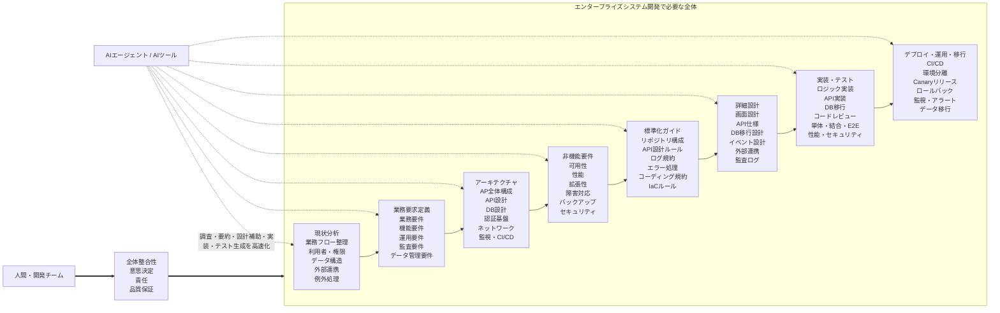
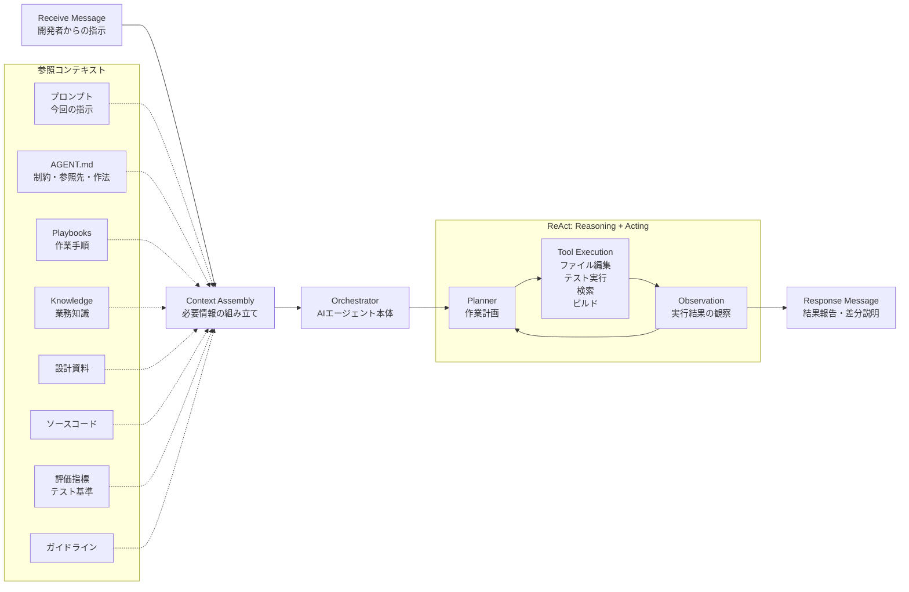
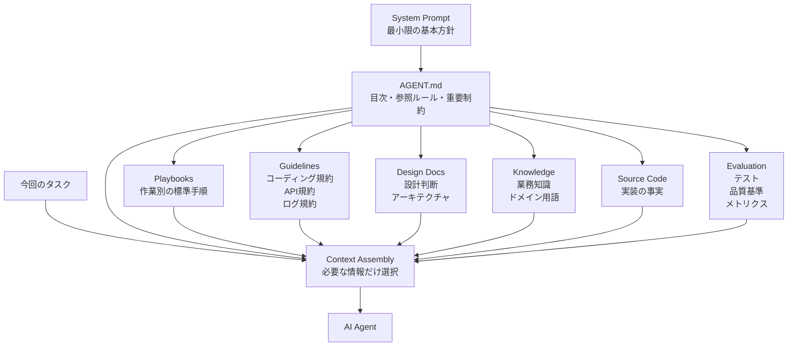
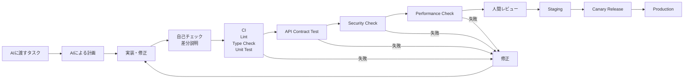
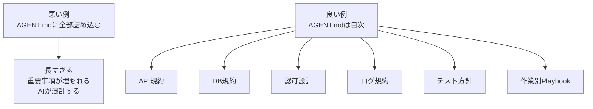
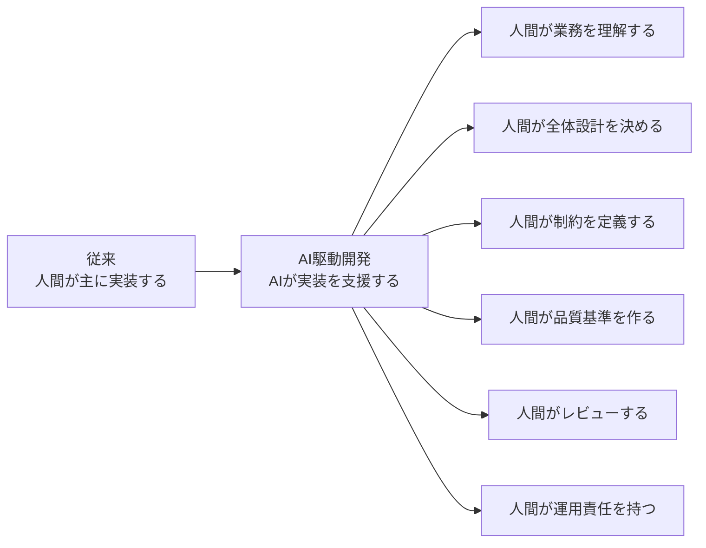

# AI駆動開発における大規模業務システム開発の注意点

## 1. 基本認識

AIツールやAIエージェントの発展により、実装、調査、設計補助、テスト生成、レビュー補助などは大幅に高速化できるようになっている。
しかし、大規模な業務システム開発においては、**「やるべき全体」そのものは従来と大きく変わらない**。

むしろAI駆動開発では、少人数でも広範囲の作業を進められるようになるため、個別技術の理解だけでなく、以下のような全体像を把握する力がより重要になる。

* 現状業務の理解
* 業務要求・機能要求・非機能要求の整理
* アーキテクチャ設計
* 標準化・開発ルールの整備
* 詳細設計
* 実装・テスト
* デプロイ・運用・移行
* 監視、障害対応、ログ、セキュリティ、コスト管理

AIは部分的な作業を高速化するが、**業務・データ・権限・監査・運用・移行まで含めた全体整合性は、人間側が設計し、管理する必要がある**。

---

## 2. エンタープライズシステム開発の全体像



AI駆動開発では、AIが各工程を支援できる一方で、工程間のつながりが曖昧なままだと、次のような問題が起きやすい。

* 実装は速いが、業務要件とずれている
* APIやDB設計が場当たり的になる
* 似たような処理が複数箇所に生成される
* 非機能要件が後回しになる
* 認証・認可・監査ログ・例外処理が抜ける
* データ移行やロールバックが考慮されない
* 運用監視や障害対応手順が不足する

そのため、AIを使うほど、**全体設計・標準化・評価基準・運用設計**を明文化することが重要になる。

---

## 3. AIエージェントの一般的な構成

AIエージェントは、単にプロンプトに答えるだけではなく、複数の情報源を参照しながら、計画、ツール実行、観察、再計画を繰り返す構成になる。



ここで重要なのは、AIエージェントにすべての情報を無制限に詰め込むことではない。
必要な情報を、必要なタイミングで、適切な粒度で参照させる設計が必要になる。

---

## 4. AI駆動開発で特に重要な注意点

## 4.1 「実装の高速化」と「開発全体の成功」は別物

AIはコード生成、テスト生成、リファクタリング、ドキュメント作成を高速化できる。
しかし、大規模業務システムでは、開発の失敗原因はコード量そのものではなく、以下にあることが多い。

* 業務理解の不足
* 部門間・会社間の業務差異の見落とし
* 例外処理の不足
* 認証・認可設計の不備
* データ移行計画の不足
* 外部連携仕様の曖昧さ
* 非機能要件の未定義
* 運用設計・監視設計の不足
* 障害時の責任分界点が不明確

AIで実装が速くなるほど、これらの未整理部分が後工程で顕在化しやすくなる。

---

## 4.2 AIに渡す前に「作業単位」を小さく閉じる

AIに大きすぎる作業を渡すと、局所的には正しそうでも、全体として不整合な成果物が出やすい。

悪い例：

> 顧客管理機能を全部作ってください。

良い例：

> 既存の認証・認可方式に従い、`Customer` の参照APIを1つ追加してください。
> API仕様は `docs/api/customer.md`、DB定義は `schema/customer.sql`、権限ルールは `docs/authz.md` を参照してください。
> 既存のログ規約に従い、単体テストとAPIテストを追加してください。

AIに渡す作業は、以下が明確であるほど安定する。

* 目的
* 対象ファイル
* 参照すべき設計資料
* 変更してよい範囲
* 変更してはいけない範囲
* API、DB、イベントなどの契約
* テスト方法
* 完了条件
* レビュー観点

---

## 4.3 システムプロンプトに情報を詰め込みすぎない

AIエージェントを使う場合、システムプロンプトに大量のルールや背景情報を入れたくなる。
しかし、大量のルールを強制的なコンテキストとして詰め込むと、エージェントが混乱し、かえって精度が落ちることがある。

望ましい構成は、以下のように役割を分けることである。



### 情報配置の考え方

| 情報       | 置き場所               | 注意点              |
| -------- | ------------------ | ---------------- |
| 基本方針     | System Prompt      | 最小限にする           |
| リポジトリ構成  | AGENT.md           | 目次として使う          |
| 開発手順     | Playbooks          | 作業別に分ける          |
| コーディング規約 | Guidelines         | 長文を直接注入しすぎない     |
| 業務知識     | Knowledge          | 必要に応じて参照させる      |
| 設計判断     | Design Docs / ADR  | 変更理由を残す          |
| 正しい仕様    | API仕様・DB定義・テスト     | ソース・テストを真実の源泉にする |
| 品質基準     | Evaluation Metrics | 自動チェック可能にする      |

---

## 4.4 AGENT.mdは「巨大なルール集」ではなく「参照の目次」にする

AIエージェント用の `AGENT.md` は、すべての規約を直書きする場所ではなく、**どの作業では何を参照するべきかを示す目次**として設計するのが望ましい。

### AGENT.mdの役割

* リポジトリ全体の構造を説明する
* 作業前に読むべき資料を示す
* 変更してはいけない領域を明示する
* よく使うテストコマンドを示す
* API変更、DB変更、バッチ変更などの標準手順へ誘導する
* セキュリティ、ログ、監査、認可などの必須観点を示す
* 判断に迷ったときの確認先を示す

### AGENT.mdの例

```markdown
# AGENT.md

## Purpose

このリポジトリは、業務システムのバックエンド、管理画面、バッチ、外部連携を含むエンタープライズアプリケーションである。

## First Read

作業前に、該当する資料を必ず確認すること。

- 全体構成: `docs/architecture/overview.md`
- API設計ルール: `docs/guidelines/api.md`
- DB設計ルール: `docs/guidelines/database.md`
- 認証・認可: `docs/security/authz.md`
- ログ・監査: `docs/guidelines/logging.md`
- エラー処理: `docs/guidelines/error-handling.md`
- テスト方針: `docs/testing/strategy.md`

## Important Rules

- API仕様を変更する場合は、OpenAPI定義とAPIテストを同時に更新する。
- DBスキーマを変更する場合は、migration、rollback、データ移行影響を必ず確認する。
- 認可処理を追加・変更する場合は、権限マトリクスを確認する。
- 個人情報をログに出力してはならない。
- バッチ処理は冪等性を持たせる。
- 外部API連携はリトライ、タイムアウト、サーキットブレーカーを考慮する。

## Test Commands

- Unit Test: `make test-unit`
- API Test: `make test-api`
- E2E Test: `make test-e2e`
- Lint: `make lint`
- Type Check: `make typecheck`
- Security Scan: `make security-check`

## Playbooks

- API追加: `docs/playbooks/add-api.md`
- DB migration: `docs/playbooks/db-migration.md`
- バッチ追加: `docs/playbooks/add-batch.md`
- 外部連携追加: `docs/playbooks/external-integration.md`
- 障害対応: `docs/playbooks/incident-response.md`
```

---

## 5. 工程別の注意点

| 工程         | AIが支援しやすいこと                | 注意点                              |
| ---------- | -------------------------- | -------------------------------- |
| 現状分析       | 業務資料の要約、業務フロー整理、論点抽出       | 暗黙運用、例外処理、部門差異を見落としやすい           |
| 業務要求定義     | 要件一覧、ユーザーストーリー、質問リスト作成     | 業務用語、権限、監査、データ保持期間を明確化する         |
| アーキテクチャ    | 構成案、比較表、ADR案の作成            | 既存システム、外部連携、運用制約と整合させる           |
| 非機能要件      | 可用性、性能、セキュリティ項目の洗い出し       | 数値目標、SLO、復旧目標、監視項目まで落とす          |
| 標準化ガイド     | API規約、ログ規約、コーディング規約の草案作成   | ルールを増やしすぎず、自動チェック可能にする           |
| 詳細設計       | API仕様、DB設計、画面仕様、イベント設計     | 境界条件、異常系、認可、監査ログ、冪等性を確認する        |
| 実装・テスト     | コード生成、単体テスト、E2Eテスト、レビュー補助  | 生成コードを鵜呑みにせず、契約・テスト・CIで検証する      |
| デプロイ・運用・移行 | CI/CD、Runbook、監視設定、移行手順の作成 | ロールバック、Canary、データ整合性、障害対応手順を用意する |

---

## 6. AI駆動開発の品質ゲート

AIに実装を任せる場合でも、人間が確認するだけでは限界がある。
大規模業務システムでは、**自動化された品質ゲート**を用意することが重要である。



### 最低限必要な品質ゲート

* Lint
* Format
* Type Check
* Unit Test
* API Contract Test
* Integration Test
* E2E Test
* DB Migration Test
* Rollback Test
* Security Scan
* Dependency Scan
* Performance Test
* Logging / Monitoring Check
* 権限・認可テスト
* 監査ログ確認
* 個人情報・機密情報の出力チェック

---

## 7. AIに渡すタスクのテンプレート

AIエージェントに作業を依頼するときは、以下のようなテンプレートにすると安定しやすい。

```markdown
# Task

## 目的

何を実現したいかを簡潔に書く。

## 背景

業務上・技術上の背景を書く。

## 対象範囲

変更してよい範囲:

- `src/modules/customer/`
- `tests/api/customer/`
- `docs/api/customer.md`

変更してはいけない範囲:

- 認証基盤
- 共通DB接続処理
- 既存の外部連携仕様

## 参照資料

- API設計ルール: `docs/guidelines/api.md`
- DB設計ルール: `docs/guidelines/database.md`
- 認可ルール: `docs/security/authz.md`
- ログ規約: `docs/guidelines/logging.md`

## 制約

- 既存APIとの後方互換性を維持すること。
- 個人情報をログに出力しないこと。
- DB migrationにはrollbackを用意すること。
- バッチ処理は冪等性を持たせること。

## 完了条件

- 実装が完了している。
- 単体テストが追加されている。
- APIテストが追加されている。
- OpenAPI定義が更新されている。
- `make test` が成功する。
- 変更内容と影響範囲を説明できる。

## レビュー観点

- 業務要件との整合性
- API契約の整合性
- DB設計の妥当性
- 認可漏れの有無
- 監査ログの有無
- エラー処理の妥当性
- テストの十分性
```

---

## 8. AI駆動開発で起きやすいアンチパターン

## 8.1 全体設計なしにAIへ実装を投げる

AIは局所的に自然なコードを生成できるが、全体設計がない状態では、設計思想がばらつく。

結果として、以下が起きやすい。

* API設計が統一されない
* DBの命名規則が揺れる
* エラー処理がバラバラになる
* ログ出力方針が統一されない
* 認可処理が画面やAPIごとに分散する
* テスト粒度が揃わない

---

## 8.2 AGENT.mdにすべてを書き込む

`AGENT.md` に大量のルール、業務知識、コーディング規約、設計資料を詰め込むと、AIが重要事項を見落としやすくなる。

望ましいのは、`AGENT.md` を目次にして、詳細は別ファイルに分ける構成である。



---

## 8.3 テストよりも生成速度を優先する

AIで実装が速くなると、テストやレビューがボトルネックになる。
このとき、テストを省略すると、短期的には速く見えるが、後工程で修正コストが増える。

AI駆動開発では、むしろ以下を強化する必要がある。

* 自動テスト
* 回帰テスト
* API契約テスト
* E2Eテスト
* セキュリティテスト
* 性能テスト
* DB migrationテスト
* ロールバック確認

---

## 8.4 非機能要件を後回しにする

AIは明示されていない非機能要件を自動的には満たさない。
特に以下は、プロンプトや設計資料に明示しておかないと抜けやすい。

* 可用性
* 性能
* 拡張性
* セキュリティ
* 監査ログ
* バックアップ
* 障害復旧
* コスト管理
* 運用監視
* データ保持期間
* 個人情報保護
* 外部連携のタイムアウト・リトライ

---

## 9. 大規模業務システムで必ず明文化すべきもの

AI駆動開発を安定させるには、以下のドキュメントを最低限整備しておくとよい。

| ドキュメント    | 目的                       |
| --------- | ------------------------ |
| システム全体構成図 | AIと人間が全体像を共有する           |
| 業務フロー     | 実装が業務とずれないようにする          |
| 用語集       | 業務用語の揺れを防ぐ               |
| 権限マトリクス   | 認可漏れを防ぐ                  |
| API仕様     | フロント・バックエンド・外部連携の契約を固定する |
| DB設計書     | データ構造と制約を明確にする           |
| イベント設計書   | 非同期処理や外部連携の整合性を保つ        |
| 非機能要件一覧   | 性能、可用性、監査、セキュリティを明確化する   |
| ログ・監査規約   | 運用・障害対応・監査に備える           |
| エラー処理規約   | 例外処理を統一する                |
| テスト方針     | AI生成物を客観的に検証する           |
| デプロイ手順    | リリース事故を防ぐ                |
| ロールバック手順  | 障害時に戻せる状態を作る             |
| データ移行手順   | 移行時の整合性を確保する             |
| AGENT.md  | AIエージェントの参照起点にする         |
| Playbooks | 作業パターンごとの標準手順を定義する       |

---

## 10. 人間の役割は「作る人」から「全体を設計し、評価する人」へ変わる

AI駆動開発では、人間の役割は単純な実装作業から、以下へ移っていく。



AIが担いやすいもの:

* 調査
* 要約
* コード生成
* テスト生成
* リファクタリング
* ドキュメント草案
* レビュー補助
* ログ分析補助
* 障害原因の仮説出し

人間が担うべきもの:

* 業務上の判断
* 要件の優先順位
* アーキテクチャ上の意思決定
* セキュリティ・監査・法務上の判断
* データ責任
* 運用責任
* 品質基準の定義
* リリース判断
* 障害時の責任判断

---

## 11. まとめ

AI駆動開発では、少人数でも大規模な業務システム開発の広い範囲を扱いやすくなる。
しかし、それは「やるべきことが減る」という意味ではない。

むしろ、AIが個別作業を高速化することで、以下の重要性が高まる。

* 全体像の理解
* 業務要求と非機能要件の明文化
* アーキテクチャと標準化
* コンテキスト設計
* AGENT.mdやPlaybookの整備
* 自動テストと品質ゲート
* 運用・監視・移行・ロールバック設計
* 人間による最終的な判断と責任

大規模業務システムにおけるAI駆動開発の本質は、
**AIに作業を任せることではなく、AIが安全に作業できる環境、制約、評価基準を設計すること**である。
